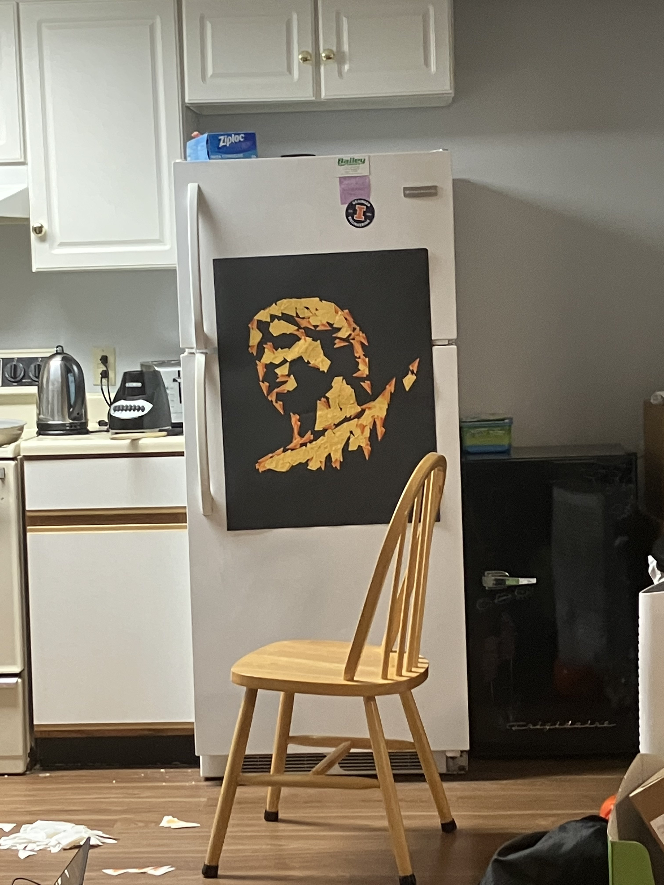
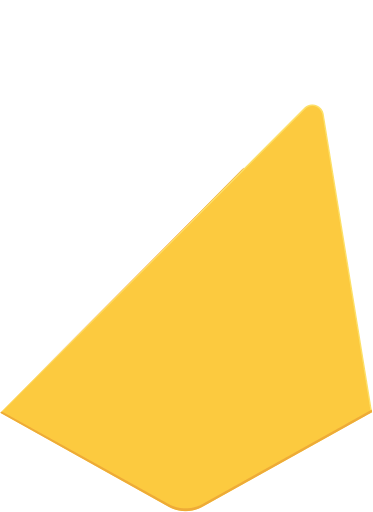
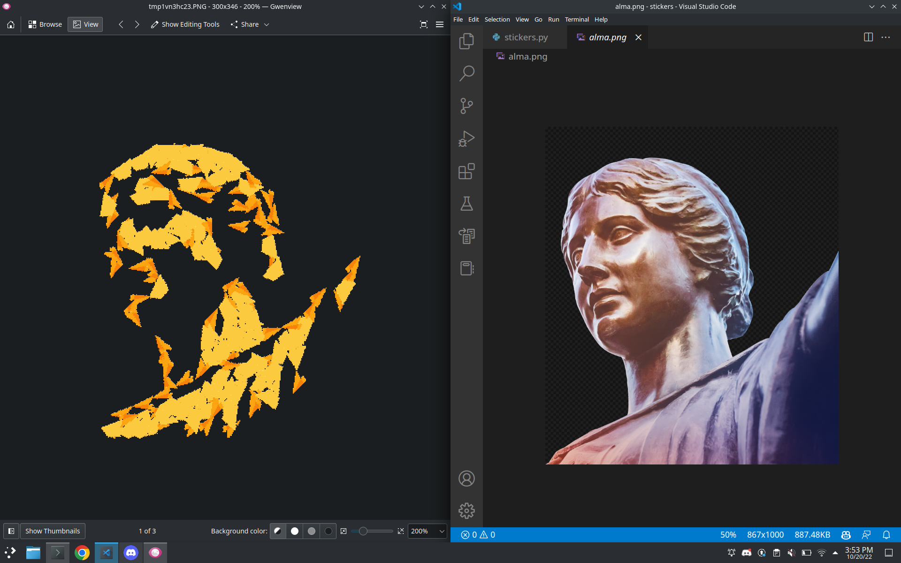
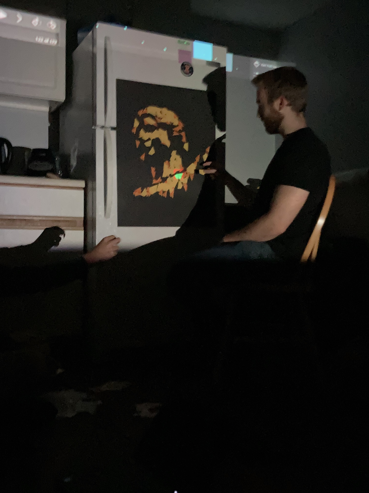

# *Alma*, 2022

# Writeup

I found these 90 Firebase stickers in the ACM room.

I cut them all in half, to get these two parts:

I then wrote some code to find out the best places to put them to look most like the Alma reference image. The algorithm is greedy. To place a sticker, it tries random locations and selects which is the best. It places the sticker and moves on to the next sticker. This is an example image the algorithm came up with:

Then I set up a projector and displayed every position and orientation to place each sticker perfectly.

Thanks to my friends for helping cut and peel the stickers :)